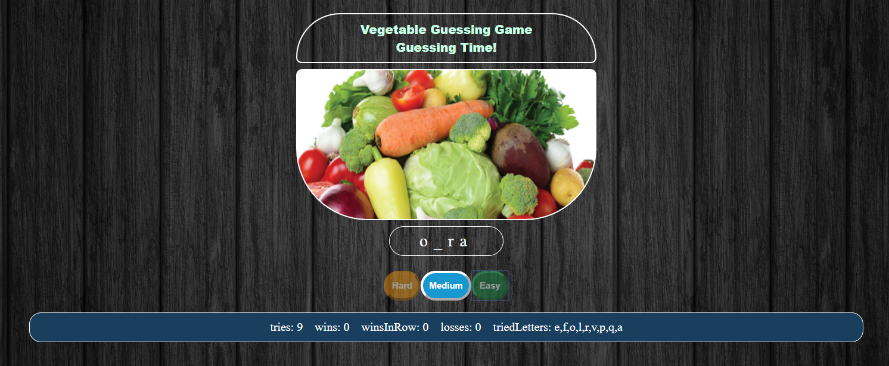

# Word Guess Game using JS, CSS, and HTML

## Overview:
This application is a single web-page aimed to implement a word guessing game using HTML5, CSS, and JavaScript.

## Project Dependencies:
This app doesn't require any of the dependencies.

## Basic Usage:
* The app runs by opening the `index.html` in the web-browser, then the game will ask the player to click any `key` to start.

## Screenshot of Usage:

  
